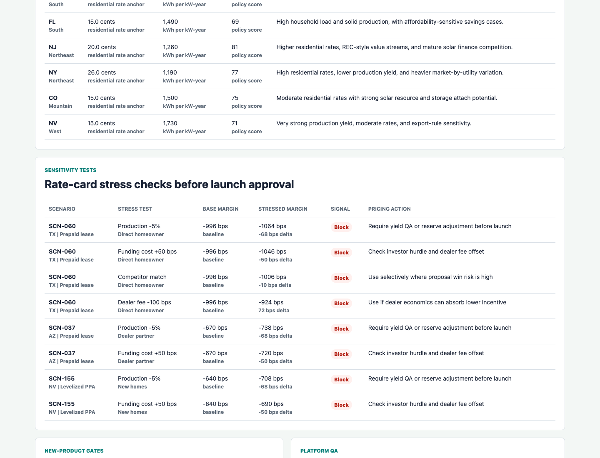
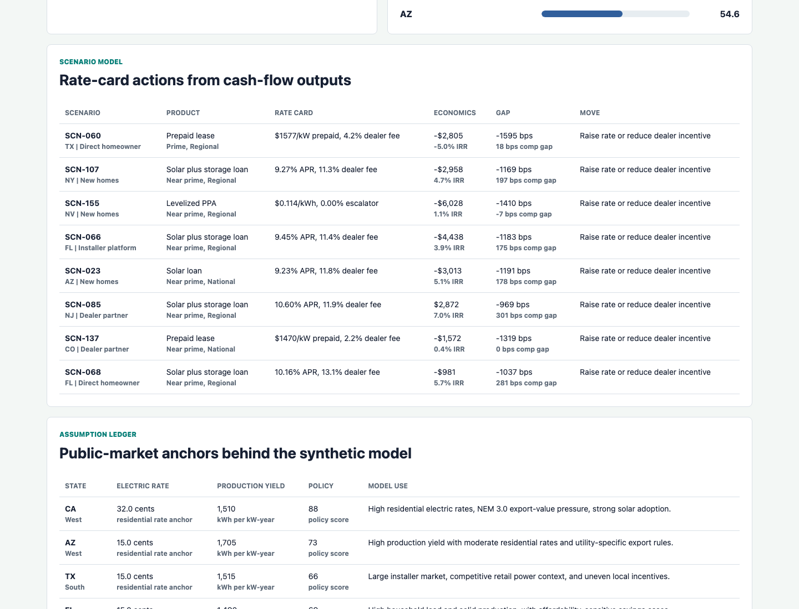
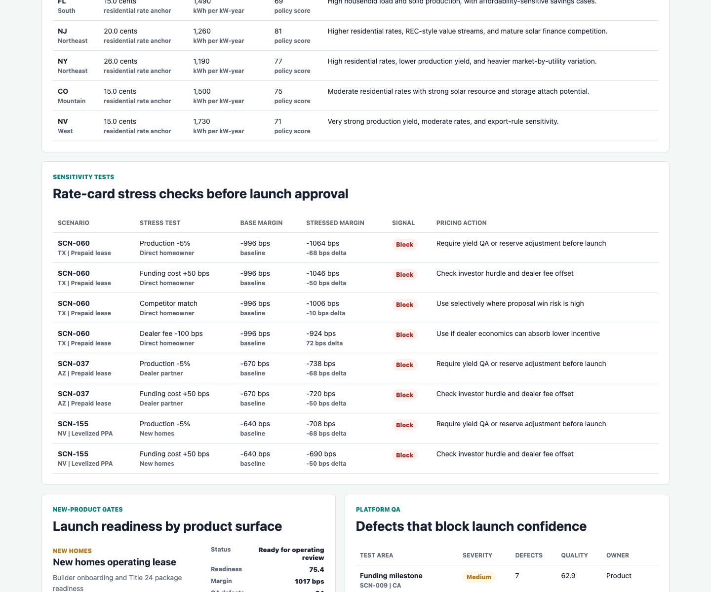
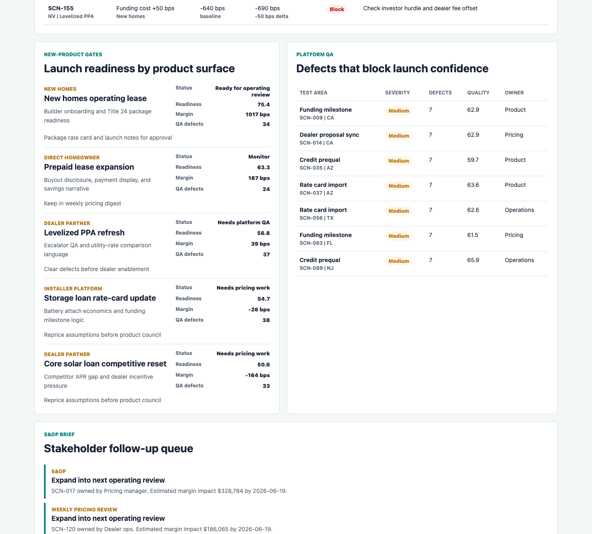

# Solar Finance Pricing Product Lab

An interactive portfolio artifact for a residential solar financing pricing and new product team. The lab shows how pricing inputs flow into fund economics, dealer rate cards, competitive intelligence, new-product launch gates, market expansion decisions, and platform QA follow-up.

## What this project demonstrates

- Excel-style pricing model logic for loan, lease, PPA, and prepaid lease scenarios.
- NPV, IRR, discounted cash-flow, contribution margin, dealer fee, customer payment, and funding-cost calculations.
- Competitive intelligence tracking across states, channels, dealer tiers, and product structures.
- Sensitivity testing for funding-cost shocks, dealer-fee movement, competitor matching, and production downside.
- New-product and market readiness scoring for operating reviews.
- Pricing-platform QA and stakeholder action queues for S&OP and launch support.

## Screenshots



Pricing cockpit showing portfolio KPIs, product economics, and the highest-priority rate-card action.



Scenario model surface with rate-card recommendations, NPV, IRR, margin gap, competitor gap, and monthly payment outputs.



Sensitivity lab showing public-market assumption anchors and directional stress tests for pricing review.



Launch and QA surface showing new-product gates, pricing-platform defects, and stakeholder follow-ups.

## Data

The scenario-level data is synthetic and generated by `scripts/score_operating_data.py` with a fixed random seed. The structure is modeled on common residential solar finance workflows, including dealer rate cards, loan and third-party-owned economics, competitor offer tracking, state expansion research, platform QA, and operating review follow-ups.

Public-market anchors shape the state assumption ledger: residential electric-rate ranges, PV production-yield bands, policy friction, and market maturity. These anchors are used only to make the synthetic model plausible. The project does not claim to represent real company performance, live dealer pricing, private investor economics, or actual competitor terms.

The synthetic generator creates scenarios across eight states, four dealer channels, five product structures, three credit bands, and three dealer tiers. It assigns project cost per watt, system size, production yield, dealer fee, funding cost, loss reserve, servicing cost, APR or escalator, tax-credit proxy, REC value, competitor offer, approval lift, and QA defects.

Loan scenarios use amortizing payment logic. Lease and PPA scenarios use owner cash flows with production, escalator, service cost, incentive value, and degradation assumptions. The model then calculates NPV, IRR, contribution margin, margin gap, competitiveness gap, readiness score, priority score, sensitivity-test signal, and launch-gate status.

## Repository guide

- `data/pricing_scenarios.csv`: Scenario-level pricing model output.
- `data/competitive_intelligence.csv`: Competitor offer and dealer incentive checks.
- `data/platform_qa.csv`: Pricing-platform QA and data-quality checks.
- `data/stakeholder_actions.csv`: S&OP, product, pricing, and QA follow-up queue.
- `analysis/outputs/rate_card_actions.csv`: Ranked pricing and rate-card recommendations.
- `analysis/outputs/market_expansion_queue.csv`: State readiness summary.
- `analysis/outputs/qa_readiness_queue.csv`: Highest-risk QA items.
- `analysis/outputs/assumption_ledger.csv`: State-level public-market anchors used by the model.
- `analysis/outputs/sensitivity_tests.csv`: Directional stress tests for pricing model review.
- `analysis/outputs/launch_gate_queue.csv`: New-product launch gate summary.
- `src/app.js` and `src/data.js`: Interactive static workbench.

## Role connection

This artifact is designed for a pricing development and new product role in residential solar finance. It demonstrates the core work called for in the role: maintaining pricing model logic, explaining how inputs affect fund economics and dealer rate cards, organizing competitive intelligence, supporting market and product research, preparing operating-review materials, stress-testing assumptions, and documenting platform QA issues.

## Run locally

```bash
npm run analyze
npm start
```

Then open `http://localhost:4173`.

## Scope

This is a public portfolio artifact, not a production pricing system. It does not use real customer data, private dealer terms, live rate cards, credit policy, investor documents, or company performance data. Sensitivity tests are directional review tools, not audited investor cash-flow recalculations. The project does show a defensible workflow for connecting pricing assumptions, finance outputs, market intelligence, product readiness, and QA follow-up into one decision artifact.
